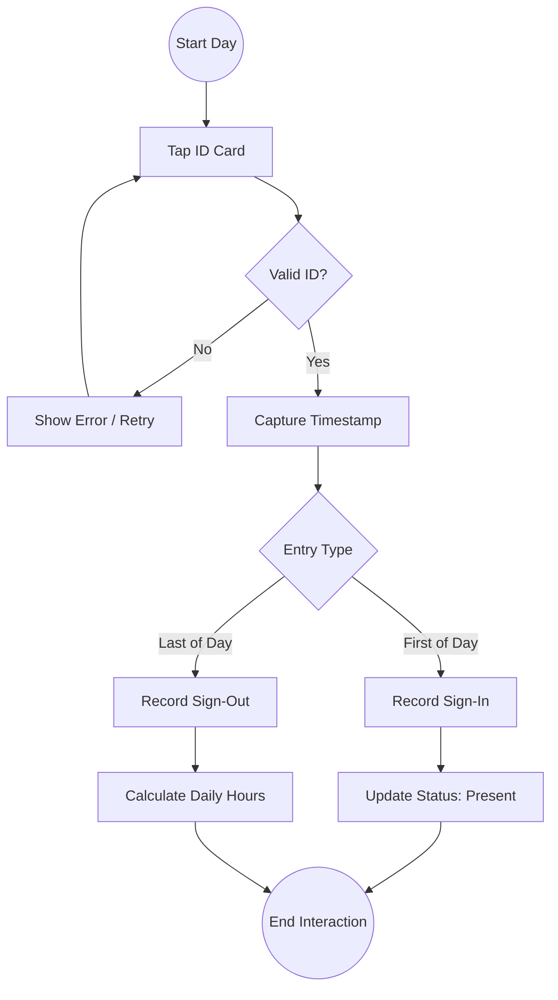
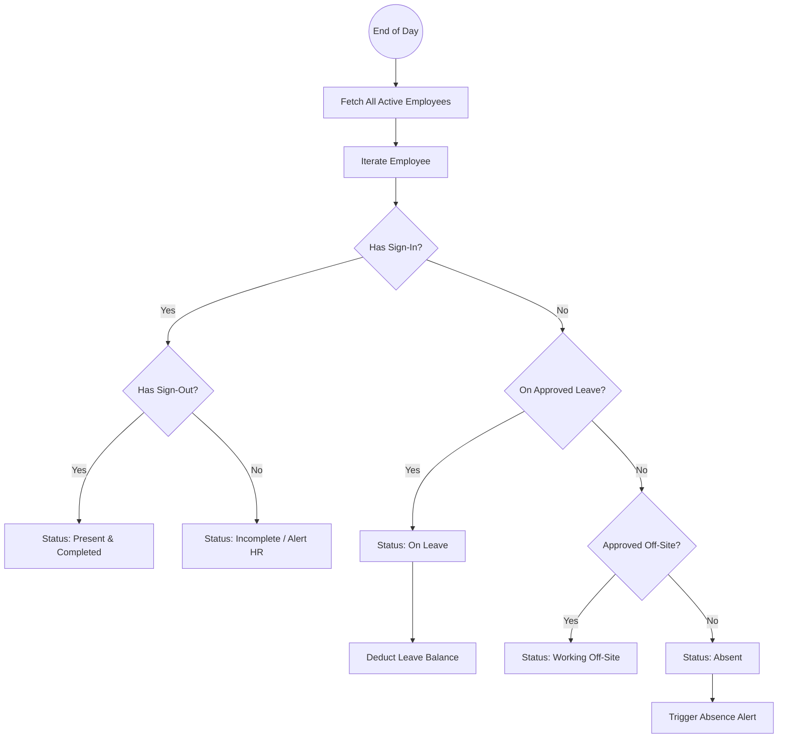

# Employee Attendance System - Workflow & Design

## 1. System Overview
The Employee Attendance System is designed to automate and streamline the tracking of employee working hours, leave, and off-site activities. It serves as a central source of truth for HR and Project Managers.

### Core Objectives
- **Accurate Timekeeping**: Capture daily sign-in/out via Employee ID Card.
- **Absence Management**: Automatically flag missing attendance as absence.
- **Leave Tracking**: Monitor and deduct medical/annual leave balances.
- **Remote/Off-site Tracking**: Record days spent working away from the office.

## 2. Actors & Roles
- **Employee**: Taps ID Card, requests leave, views dashboard.
- **System (Hardware/Software)**: Captures timestamp, validates ID, updates DB.
- **HR/Manager**: Approves leave, views aggregate reports, manages exceptions.

## 3. Workflow Processes

### 3.1 Daily Attendance Flow (Sign-in / Sign-out)

### 3.2 Absence & Leave Logic (End-of-Day Processing)

This process runs automatically at the end of the working day (e.g., 11:59 PM).

## 4. Data Entities & Tracking

### Employee Record
- `EmployeeID`: Unique Identifier
- `Name`, `Department`, `Role`
- `CardID`
- `LeaveBalance`: { Medical: 14, Annual: 14, ... }

### Daily Log
- `Date`
- `SignInTime`
- `SignOutTime`
- `Status`: [Present, Absent, OnLeave, OffSite, Incomplete]
- `Location`: [Office, ClientSite, Home]

## 5. Dashboard Features

### Employee View
- **Today's Status**: Large indicator (Signed In / Out).
- **Attendance History**: Calendar view with color codes (Green=Present, Red=Absent, Blue=Leave).
- **Leave Balance**: Progress bars showing remaining Medical/Annual leave.
- **Action Buttons**: "Apply for Leave", "Register Off-Site Work".

### Manager/HR View
- **Real-time Attendance**: Counter of Present vs. Absent employees today.
- **Absence Alerts**: List of employees absent without leave.
- **Off-Site List**: Who is working remotely today.
- **Reports**: Monthly attendance summary, Lateness trends.

## 6. Exception Handling
- **Forgot ID Card**: Manual sign-in request via dashboard (requires Manager approval).
- **Missed Sign-out**: System auto-closes entry at midnight, flags for review next day.
- **Sick Leave (Emergency)**: Employee marks "Sick" on app; requires uploading Medical Certificate (MC) later to validate.
